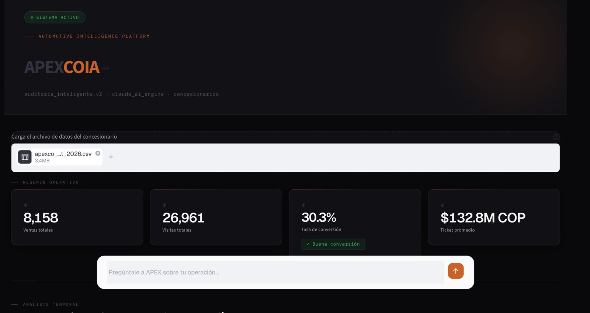
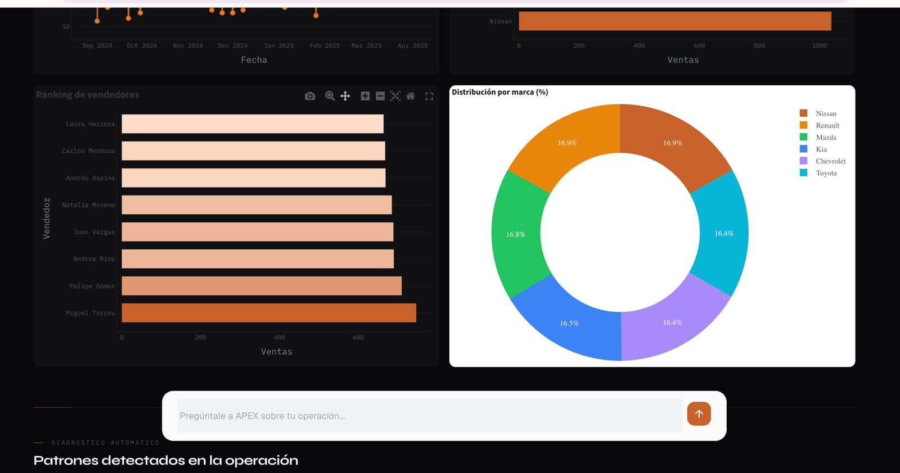
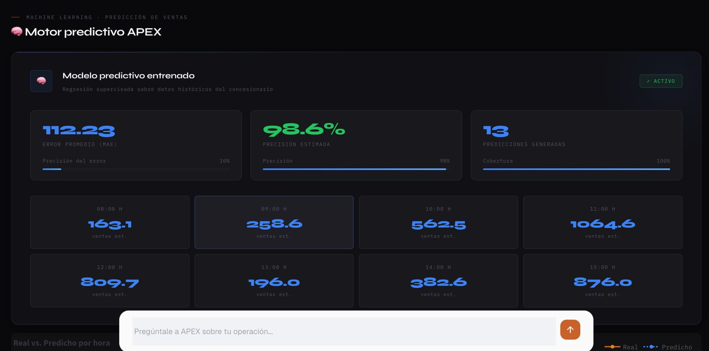
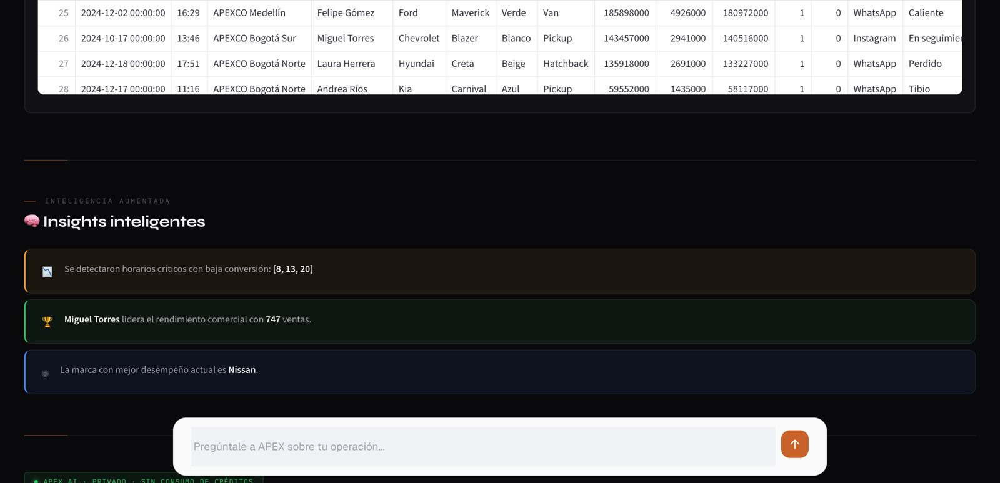
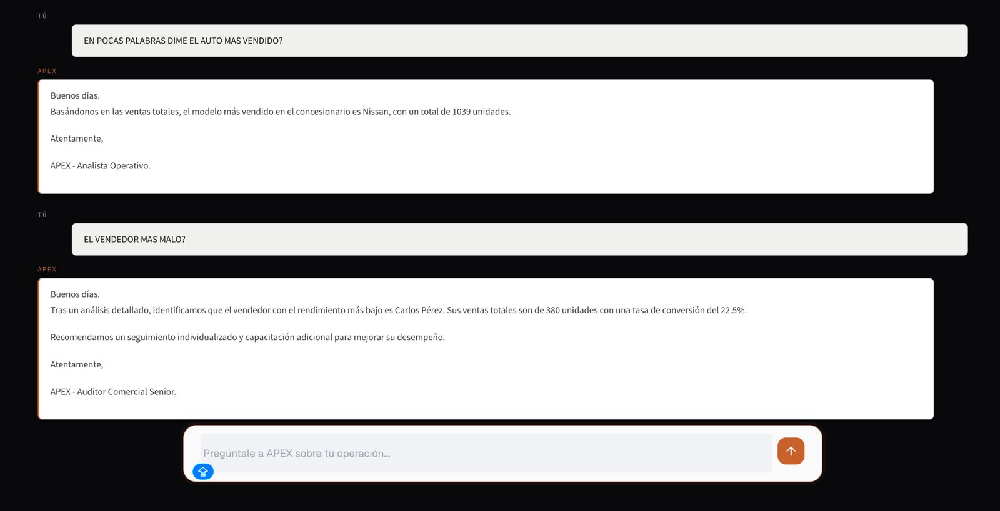

# 🚘 APEXCO IA

<div align="center">

## Plataforma de Inteligencia Operacional para Concesionarios Automotrices

### Transformando operaciones automotrices en decisiones impulsadas por inteligencia artificial.

APEXCO IA es una plataforma SaaS de nueva generación diseñada para concesionarios automotrices que combina analítica avanzada, inteligencia operacional e IA conversacional para detectar pérdidas invisibles, optimizar desempeño comercial y generar recomendaciones accionables en tiempo real.

<br>


</div>

---

# ✨ Visión Ejecutiva

Los concesionarios generan enormes volúmenes de información todos los días.

Pero tener datos no significa tener inteligencia.

APEXCO IA nace para resolver ese problema mediante una capa de inteligencia operacional capaz de analizar comportamiento comercial, rendimiento de vendedores, conversiones, tráfico, desempeño de marcas y métricas operativas para transformar datos complejos en decisiones ejecutivas inmediatas.

La plataforma funciona como un:

> 🧠 Auditor inteligente impulsado por IA para concesionarios automotrices.

---

# 🚨 El Problema

## Los concesionarios están saturados de datos pero carecen de interpretación estratégica.

Actualmente muchas operaciones automotrices dependen de:

- Excel y reportes manuales
- decisiones lentas,
- métricas fragmentadas,
- poca visibilidad operacional,
- análisis reactivos,
- y pérdida silenciosa de oportunidades comerciales.

### Consecuencias comunes:

- 📉 Caídas de conversión no detectadas
- 💸 Pérdidas operativas invisibles
- 🕒 Tiempos lentos de reacción
- 📊 KPIs difíciles de interpretar
- ⚠️ Falta de alertas inteligentes
- 🚫 Ausencia de predicción operativa
- 🔍 Dificultad para detectar patrones reales

La mayoría de concesionarios ya tienen datos.

El verdadero problema es:

> No tienen inteligencia operacional.

---

# 💡 La Solución

APEXCO IA transforma datos operativos en inteligencia accionable mediante:

- analítica avanzada,
- IA conversacional,
- simulación predictiva,
- detección automática de patrones,
- y generación de recomendaciones inteligentes.

La plataforma permite que un concesionario pueda:

✅ Detectar riesgos operativos  
✅ Identificar oportunidades comerciales  
✅ Optimizar desempeño de vendedores  
✅ Mejorar conversiones  
✅ Entender comportamiento operativo  
✅ Tomar decisiones basadas en IA  

Todo desde un único dashboard ejecutivo.

---

# 🚀 Funcionalidades Principales

---

## 📊 Dashboard Ejecutivo Inteligente

Visualización avanzada de métricas operativas y comerciales en tiempo real.

### Incluye:
- Ventas por período
- Conversión comercial
- Rendimiento de vendedores
- Desempeño por marcas
- Análisis por horarios
- Ticket promedio
- Tráfico comercial
- KPIs operativos
- Visualizaciones interactivas

---

## 🤖 IA Conversacional Integrada

Asistente conversacional impulsado por Claude AI capaz de analizar contexto operativo y responder preguntas estratégicas.

### Ejemplos:
- “¿Por qué cayó la conversión esta semana?”
- “¿Qué vendedor está bajo rendimiento?”
- “¿Qué horarios generan más ventas?”
- “Simula un aumento del 20% en visitas.”

---

## 🧠 Auditoría Operacional Automática

La plataforma detecta automáticamente comportamientos críticos y anomalías operativas.

### Detecta:
- Baja conversión
- Ineficiencias comerciales
- Pérdidas invisibles
- Horarios improductivos
- Caídas de desempeño
- Riesgos operacionales
- Patrones atípicos

---

## 📈 Simulación Predictiva

Motor de simulación para proyección de escenarios operativos.

### Permite:
- Simular crecimiento comercial
- Evaluar escenarios de conversión
- Proyectar ingresos
- Analizar impacto operativo
- Explorar estrategias de optimización

---

## 🔍 Detección Inteligente de Patrones

APEXCO IA identifica comportamientos ocultos que dashboards tradicionales no logran detectar.

### Incluye:
- Tendencias operativas
- Correlaciones comerciales
- Segmentación temporal
- Comportamiento de tráfico
- Análisis comparativo

---

## ⚡ Recomendaciones Accionables

El sistema genera sugerencias automáticas basadas en comportamiento operacional real.

### Ejemplos:
- Optimización de horarios
- Redistribución comercial
- Ajuste de estrategias
- Priorización de vendedores
- Corrección de ineficiencias

---

# 🌎 Visión del Producto

## Construyendo la próxima generación de inteligencia automotriz para LATAM

APEXCO IA busca convertirse en la plataforma líder de inteligencia operacional para concesionarios automotrices en Latinoamérica.

La visión es evolucionar desde un dashboard analítico hacia un:

> Sistema Operativo de Inteligencia Automotriz.

Una plataforma capaz de conectar:
- operaciones,
- desempeño comercial,
- comportamiento de clientes,
- predicción operacional,
- y decisiones ejecutivas impulsadas por IA.

---

# 🏗️ Arquitectura de la Plataforma

```text
APEXCO IA
│
├── analytics.py          → Motor analítico y cálculo de KPIs
├── chat_ai.py            → Inteligencia conversacional con Claude AI
├── simulator.py          → Simulación predictiva
├── recommendations.py    → Motor de recomendaciones inteligentes
├── validators.py         → Validación e integridad de datos
├── data_loader.py        → Carga y procesamiento de datasets
├── app.py                → Aplicación principal Streamlit
│
└── data/
    └── sample_apexco.csv → Dataset demostrativo
```

---

# ⚙️ Stack Tecnológico

| Tecnología | Función |
|---|---|
| Python | Backend y lógica analítica |
| Streamlit | Interfaz SaaS interactiva |
| Pandas | Procesamiento de datos |
| NumPy | Computación numérica |
| Plotly | Visualización avanzada |
| Claude AI API | Inteligencia conversacional |
| dotenv | Variables de entorno |

---
# 🖼️ Capturas de Pantalla

## 📊 Dashboard Ejecutivo Inteligente

Visualización avanzada de métricas operativas y comerciales en tiempo real.

- Conversión comercial
- Rendimiento de vendedores
- Tráfico operativo
- KPIs estratégicos
- Ticket promedio
- Desempeño por marcas
- Análisis temporal inteligente



---

## 🤖 IA Conversacional Integrada

Asistente impulsado por Claude AI capaz de analizar contexto operacional y responder preguntas estratégicas sobre el negocio en tiempo real.

### Ejemplos:
- “¿Qué horarios tienen baja conversión?”
- “¿Qué vendedor tiene mejor rendimiento?”
- “¿Qué marca genera más ventas?”
- “Simula un aumento de tráfico del 20%.”



---

## 🧠 Auditoría Operacional Inteligente

Motor automático de detección de patrones, anomalías y oportunidades comerciales invisibles.

### Capacidades:
- Detección de pérdidas silenciosas
- Identificación de horarios críticos
- Análisis de eficiencia operacional
- Insights automáticos impulsados por IA
- Recomendaciones accionables



---

## 📈 Simulación Predictiva

Sistema de proyección operacional capaz de modelar escenarios comerciales en tiempo real.

### Permite:
- Simular incremento de vendedores
- Evaluar impacto de campañas
- Analizar cambios en conversión
- Proyectar ingresos operativos
- Optimizar desempeño comercial



---

## 🔍 Insights Inteligentes

Generación automática de insights estratégicos basados en comportamiento real del concesionario.

### Detecta automáticamente:
- Horarios con baja conversión
- Patrones comerciales ocultos
- Vendedores top performance
- Oportunidades de optimización
- Riesgos operativos



---

# 📈 Resultados Detectados

APEXCO IA ya es capaz de analizar operaciones reales de concesionarios automotrices mediante inteligencia operacional y analítica avanzada.

## Capacidades demostradas

- ✅ Análisis de más de 26,000 visitas comerciales
- ✅ Procesamiento de más de 8,000 ventas operativas
- ✅ Detección automática de horarios con conversión menor al 15%
- ✅ Identificación de vendedores top performance
- ✅ Predicción operativa mediante Machine Learning
- ✅ Simulación de escenarios comerciales
- ✅ Generación de recomendaciones accionables
- ✅ Insights automáticos impulsados por IA
- ✅ Análisis de tráfico y comportamiento temporal
- ✅ Detección de oportunidades invisibles

---

# 💰 Modelo SaaS

APEXCO IA opera bajo un modelo SaaS B2B diseñado para concesionarios automotrices.

| Concepto | Valor |
|---|---|
| Suscripción mensual | $499.000 COP |
| Setup e integración inicial | $1.000.000 COP |
| Tipo de negocio | SaaS B2B |
| Escalabilidad | Multi-concesionario |
| Mercado objetivo | LATAM |
| Modelo operativo | Suscripción recurrente |

## Visión Comercial

El modelo busca construir una plataforma escalable capaz de convertirse en la capa de inteligencia operacional para concesionarios en Latinoamérica.

La estrategia está enfocada en:
- ingresos recurrentes,
- expansión regional,
- arquitectura enterprise,
- y crecimiento SaaS sostenible a largo plazo.

---

# 🧪 Instalación

## 1. Clonar repositorio

```bash
git clone https://github.com/JHONATHANUNI/APEXCO-IA-2026.git